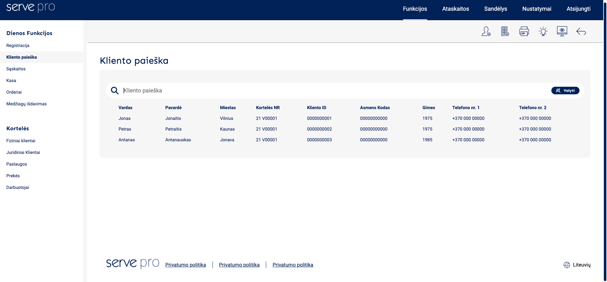

## Requirements

- Reproduce design from AdobeXD using react and plain css with BEM
- Use SVG Icons from AdobeXD file

## Preview Screenshot

## Some Fun Features

- Plain css tooltips
- Custom Scrollbar
- Grid layout
- React router 6 routing
- React context for state management

## Available Scripts

In the project directory, you can run:

### `yarn start`

Runs the app in the development mode.\
Open [http://localhost:3000](http://localhost:3000) to view it in the browser.

The page will reload if you make edits.\
You will also see any lint errors in the console.

### `yarn test`

Launches the test runner in the interactive watch mode.

### `yarn build`

Builds the app for production to the `build` folder.\
It correctly bundles React in production mode and optimizes the build for the best performance.
